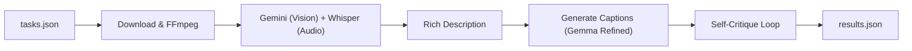

# 📝 แผนงานและสรุปกลยุทธ์การแข่ง AMD Hackathon ACT II 2026 (Track 2)
> **ชื่อไฟล์อ้างอิงหลักที่ใช้ดีไซน์ระบบ:** [hackathon_strategy_guide.md](file:///d:/ALL%20project/Hackathon%20AI%20AMD/hackathon_strategy_guide.md) และ `Participant Guide_ AMD Developer Hackathon (ACT II).pdf`

---

## 📌 1. บทสรุปภาพรวมโปรเจกต์ (Project Summary)

การแข่งขันครั้งนี้เราแข่งใน **Track 2: Video Captioning Agent** เป้าหมายคือสร้างระบบอัตโนมัติ (Automation) รันบน Docker Container (สถาปัตยกรรมแบบ `linux/amd64` ขนาดของ Container ตอนบีบอัดห้ามเกิน 10GB) เพื่อทำภารกิจต่อไปนี้แบบไม่มีการโต้ตอบจากผู้ใช้:
1. อ่านไฟล์โจทย์จาก `/input/tasks.json` บนระบบของกรรมการ
2. ดาวน์โหลดวิดีโอตัวเต็มมาวิเคราะห์ข้อมูลภาพและเสียง
3. เขียนคำบรรยาย (Caption) ภาษาอังกฤษส่งกลับไปที่ `/output/results.json` ให้ครบถ้วนทั้ง 4 สไตล์
4. ทำงานทั้งหมดให้สำเร็จเสร็จสิ้นด้วย Exit Code 0 ภายในเวลาจำกัดสูงสุด **ไม่เกิน 10 นาที** (จำนวนวิดีโอในระบบประเมินผลจริงมีประมาณ 12 คลิป)

### 💡 ข้อสรุปเชิงกลยุทธ์ของทีมเรา:
*   **ทำระบบอัตโนมัติ 100% ไม่ทำ UI/UX (No Platform):** เนื่องจากกรรมการตรวจงานผ่านโค้ดเบื้องหลัง ไม่มีคนมากดดูหน้าเว็บหรือแอปพลิเคชัน ทุกอย่างต้องรันเงียบๆ และจบได้เองด้วยสคริปต์ Python
*   **ใช้โมเดลผสม (Hybrid Model API):** ใช้ **Gemini 2.5 Flash** เป็นแกนหลักเพราะรองรับ Input แบบวิดีโอโดยตรง (Multimodal) ประมวลผลได้รวดเร็วมากและอยู่ในระดับ Free Tier ของ Google AI Studio จากนั้นใช้ **Gemma** (ผ่าน Fireworks AI API) สำหรับปรับแต่งคำและช่วยตรวจงานเพื่อลุ้นรับรางวัลพิเศษ **Gemma Prize มูลค่า $3,000**
*   **ไม่ทำ Fine-tune โมเดลเอง (No Local Fine-tuning):** เนื่องจากเวลาการแข่งขันจำกัด (เหลือประมาณ 4 วันเดดไลน์ 11 กรกฎาคม) ทีมมีสมาชิก 2 คน และมีความเสี่ยงสูงที่จะทำให้ขนาดของ Docker Image บวมเกิน 10GB การใช้โมเดลใหญ่ชั้นนำผ่าน API ร่วมกับเทคนิค Prompt Engineering ที่ชาญฉลาดจึงคุ้มค่าและปลอดภัยที่สุด
*   **มุกตลกแบบ Connected Humor (ตลกอิงดีเทลจริง):** ในสไตล์ `sarcastic` และ `humorous_tech` เราจะไม่สั่งให้เขียนมุกกว้างๆ ที่เดาได้ทั่วไป แต่จะสั่งให้ AI ดึงเอาองค์ประกอบหรือวัตถุเด่นๆ ที่เห็นจริงในคลิปมาแต่งมุก เพื่อชนะใจ AI กรรมการ (LLM-Judge)

---

## ⚙️ 2. ขั้นตอนการทำงานของข้อมูล (Data Pipeline)

ระบบจะทำงานเป็นแบบเส้นตรงเรียงลำดับทีละขั้น (Linear Sequential Pipeline) ดังนี้:

1.  **อ่านโจทย์และดึงลิงก์ (Input Parsing):** สคริปต์ Python เปิดอ่านไฟล์จากทรา็กเกอร์ `/input/tasks.json` เพื่อดึงไอดีคลิป (`task_id`), ลิงก์ URL วิดีโอ (`video_url`) และเช็คลิสต์สไตล์ที่ระบบต้องการ
2.  **ดาวน์โหลดและแยกเสียง (Ingestion & Demuxing):** ดึงคลิปวิดีโอมาเซฟลงดิสก์ชั่วคราวใน Container และใช้เครื่องมือ **FFmpeg** แยกแทร็กเสียงออดิโอออกมาเป็นไฟล์ใหม่แยกต่างหาก
3.  **วิเคราะห์ภาพและเสียง (Multimodal Feature Extraction):**
    *   ส่งไฟล์วิดีโอให้ **Gemini 2.5 Flash** แกะข้อมูลเชิงลึก 3 เลเยอร์ (สิ่งที่เห็น, ลำดับการเคลื่อนไหว, บรรยากาศแวดล้อม)
    *   ส่งไฟล์เสียงเข้าสู่ระบบถอดความเพื่อแปลงเสียงพูดเป้นข้อความ (Text Transcription) และจับจังหวะเสียงแวดล้อมเด่นๆ
    *   ผสานข้อมูลภาพและเสียงเข้าด้วยกันเป็นข้อความบรรยายฉากที่สมบูรณ์แบบ (**Rich Description Metadata**)
4.  **เขียนและปรับแต่งแคปชัน (Caption Generation & Refinement):** สั่งให้ AI ร่างแคปชันขึ้นมา 4 สไตล์ตามรายละเอียดในฉาก จากนั้นส่งแคปชันสไตล์เทคโนโลยีและสไตล์ประชดประชันส่งต่อไปให้โมเดล **Gemma** ขัดเกลาสำนวนและศัพท์แสงให้เข้าที่
5.  **ตรวจคะแนนตัวเอง (Self-Critique Loop):** ใช้โมเดล Gemma สวมบทเป็นผู้ตัดสิน ให้คะแนนและประเมินคำบรรยายตัวเองก่อนเขียนลงไฟล์จริง หากคะแนนต่ำกว่า 8/10 ระบบจะรวบรวมคอมเมนต์แล้วส่งกลับไปสั่งให้ AI แก้ไขงานใหม่จนกว่าจะผ่านเกณฑ์
6.  **บันทึกผลลัพธ์ (Output Delivery):** ตรวจเช็คฟอร์แมต JSON ให้ตรงตามสเปคอย่างสมบูรณ์แบบ แล้วเซฟทับไปที่ `/output/results.json` ก่อนสั่งสั่งจบการทำงานของระบบด้วยคำสั่งคืนค่าความสำเร็จ (Exit Code 0)

---

## 🛠️ 3. แผนรับมือเมื่อเกิดปัญหา (Error Handling Use Cases)

เพื่อป้องกันโปรแกรมหยุดทำงานกะทันหัน หรือทำงานช้าจนเกินเวลาจำกัด 10 นาที ระบบจะถูกเขียนโค้ดดักเคสฉุกเฉินดังนี้:

*   **Use Case 1: ลิงก์วิดีโอเสีย หรือเน็ตเวิร์กช้าจนดาวน์โหลดไม่เสร็จ**
    *   *วิธีรับมือ:* กำหนดเวลาในการดาวน์โหลดสูงสุด (Timeout) ไว้ที่ 30 วินาทีต่อคลิป และมีระบบลองใหม่ (Retry) ไม่เกิน 3 ครั้ง หากยังล้มเหลวให้เขียน Log ประวัติปัญหา ข้ามคลิปนี้ไปทำคลิปถัดไปทันที เพื่อไม่ดึงเวลาของระบบจนล่มทั้งหมด
*   **Use Case 2: วิดีโอบางคลิปไม่มีเสียง (Silent Video)**
    *   *วิธีรับมือ:* เมื่อ FFmpeg แยกเสียงออกมาแล้ว โค้ดจะเช็คขนาดไฟล์และคลื่นเสียง หากพบว่าขนาดไฟล์เกือบเป็นศูนย์หรือว่างเปล่า ให้ระบบสลับข้าม (Skip) ขั้นตอนถอดเสียงออดิโออัตโนมัติ เพื่อป้องกันไม่ให้โมเดลวิเคราะห์เสียงขึ้นสถานะพังกลางคัน แล้วใช้เฉพาะรายละเอียดจากการแกะภาพมาประมวลผลต่อ
*   **Use Case 3: ระบบตรวจคะแนนตัวเองติดลูปไม่สิ้นสุด (Infinite Loop)**
    *   *วิธีรับมือ:* กำหนดโควต้าจำกัดการส่งแก้งานสูงสุด (Max Critique Retries) ไว้ที่ 2 รอบต่อสไตล์ หากแก้ไขครบ 2 รอบแล้วยังไม่ได้คะแนน 8/10 ให้ตัดลูปแล้วดึงเอาแคปชันร่างที่ได้คะแนนสูงสุดในประวัติประเมินขึ้นมาส่งออกใช้งานทันทีเพื่อเซฟเวลา
*   **Use Case 4: AI คายผลลัพธ์ JSON ออกมาผิดฟอร์แมต (Malformed JSON)**
    *   *วิธีรับมือ:* ใช้โครงสร้างการจำกัดประเภทอย่าง **Pydantic** ร่วมกับคำสั่งดักจับข้อผิดพลาด `try-except json.JSONDecodeError` ใน Python หากวิเคราะห์แล้วว่าฟอร์แมตพัง ให้ใช้ระบบดึงข้อมูลแบบ Regular Expression (Regex) เพื่อกู้คืนก้อน JSON ด้านใน หรือให้โมเดลความเร็วสูงอย่าง Gemini 2.5 Flash ตัวสำรองคอยซ่อมแซม JSON ด่วนก่อนเขียนบันทึก

---

## 📅 4. แผนการลุยงานช่วงบ่ายวันนี้ (Immediate Action Plan)

แบ่งภารกิจสำหรับสมาชิกในทีม 2 คนเพื่อเริ่มงานทันทีในช่วงบ่ายวันนี้:

### 👤 ฝั่งคุณ (Planner & Prompt Engineer)
1. เข้าใช้บริการหน้าเว็บ **Google AI Studio** และเลือกใช้โมเดลหลักเป็น **Gemini 2.5 Flash** (Free Tier)
2. ทำการดาวน์โหลดคลิปวิดีโอตัวอย่างทั้ง 3 ตัวจากลิงก์ทางการลงเครื่องคอมพิวเตอร์
3. อัปโหลดคลิปทดสอบเข้าสู่ระบบ AI Studio เพื่อเริ่มร่าง คัดเกลา และทดสอบ Prompt ในส่วนของ 3-Layer Scene Analysis และเก็บตัวอย่างแคปชัน 4 สไตล์ที่เด็ดที่สุด

### 👤 ฝั่งเพื่อนร่วมทีม (Developer & Infrastructure)
1. ทำการจัดตั้งโครงสร้างโฟลเดอร์โปรเจกต์ (Project Structure) ในเครื่องคอมพิวเตอร์ส่วนตัว
2. สร้างโฟลเดอร์จำลอง `/input/` และ `/output/` พร้อมเขียนไฟล์จำลองโจทย์ `tasks.json` ที่ระบุตำแหน่งลิงก์วิดีโอตัวอย่าง
3. เขียนสคริปต์ Python เบื้องต้นเพื่อเปิดอ่านไฟล์ JSON และเรียกชุดคำสั่งดาวน์โหลดไฟล์วิดีโอจาก URL สตรีมลงในเครื่องได้โดยอัตโนมัติแบบเสถียร
