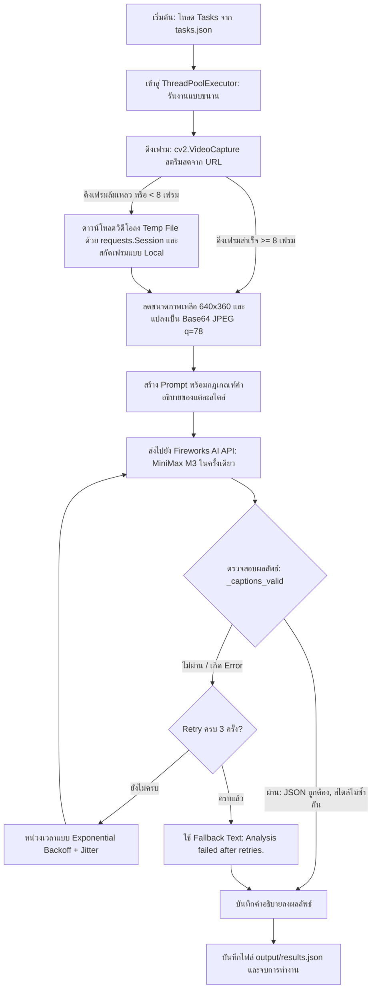

# การวิเคราะห์ VeloCap — High-Speed Video Agent (คะแนน 0.91)
โครงการ **VeloCap** (พัฒนาโดย Porosh67) ได้รับคะแนน **0.91** ในการแข่งขัน **AMD Developer Hackathon (ACT II) — Track 2 (Video Captioning Agent)** ซึ่งถือเป็นคะแนนที่สูงและมีความเสถียรมาก เอกสารฉบับนี้ทำการวิเคราะห์จุดแข็ง (Strengths) และโครงสร้างการทำงาน (Pipeline) อย่างละเอียด เพื่อเป็นแนวทางในการประยุกต์ใช้กับโครงการของคุณ

---

## 1. วิเคราะห์จุดแข็งหลัก (Key Strengths)

การที่ VeloCap ทำคะแนนได้สูงถึง 0.91 มาจากสถาปัตยกรรมที่ออกแบบมาเพื่อ **ความเร็ว (Speed)**, **ความคุ้มค่าด้าน Token (Cost Efficiency)** และ **ความเสถียร (Robustness)** ดังนี้:

### 1.1 การเลือกใช้ Native Multimodal Model ที่เหมาะสม (MiniMax M3 via Fireworks AI)
* **Native Multimodality:** `minimax-m3` ถูกเทรนขึ้นมาแบบ Multimodal ตั้งแต่เริ่มต้น (Text, Image, Video) ต่างจากโมเดล Image-to-Text ทั่วไปที่ใช้วิธีนำภาพมาต่อกัน ทำให้โมเดลนี้เข้าใจลำดับเหตุการณ์และการเชื่อมโยงของเวลา (Temporal Consistency) ในวิดีโอได้ดีมาก
* **MoE Architecture (Mixture of Experts):** มีพารามิเตอร์รวม 428B แต่มีเพียง **23B active parameters** ต่อ token ทำให้ตอบสนองได้เร็วเทียบเท่าโมเดลขนาดเล็ก แต่ให้ระดับการใช้เหตุผล (Reasoning) ของโมเดลขนาดใหญ่
* **Massive Context Window (512K tokens):** รองรับการส่งภาพ 24 เฟรม (แบบ base64) ไปใน API Call เดียวได้อย่างสบาย โดยไม่มีปัญหาเฟรมตกหล่นหรือหน่วยความจำเต็ม

### 1.2 สถาปัตยกรรมดึงเฟรมแบบสองเส้นทาง (Dual-Path Frame Extraction)
* **Stream First:** จะพยายามเปิดสตรีมวิดีโอจาก URL โดยตรงด้วย OpenCV (`cv2.VideoCapture(video_url)`) ก่อน ซึ่งหากสำเร็จ จะดึงเฟรมและแปลงภาพแบบ on-the-fly โดยไม่ต้องดาวน์โหลดไฟล์วิดีโอลงดิสก์ ช่วยลดเวลาและ Network Bandwidth ได้มหาศาล
* **Download Fallback:** หากการสตรีมโดยตรงล้มเหลว หรือดึงเฟรมได้น้อยเกินไป (`< 8 เฟรม`) ระบบจะสลับไปดาวน์โหลดไฟล์วิดีโอเต็มมาเก็บไว้ใน `tempfile` เพื่อทำการดึงเฟรมแบบ Local แล้วจึงลบไฟล์ทิ้ง ช่วยการันตีว่าจะมีเฟรมส่งให้โมเดลเสมอ

### 1.3 ระบบตรวจสอบและรับประกันคุณภาพผลลัพธ์ (In-Flight Validation & Safety Guards)
* **Word Overlap & Jaccard-like Similarity Check:** มีฟังก์ชัน `_captions_valid` เพื่อสแกนความคล้ายคลึงกันของข้อความในแต่ละสไตล์ หากพบว่ามีความคล้ายคลึงกันเกิน **75%** (`_word_overlap_ratio > 0.75`) หรือมีความยาวสั้นกว่า 8 คำ ระบบจะตีความว่าเป็นโมเดลส่งผลลัพธ์ซ้ำซาก (Repetitive) และสั่ง **Retry** ทันที เพื่อป้องกันคะแนนสไตล์ตกหล่น
* **JSON Schema Enforcement:** กำหนด `response_format={"type": "json_object"}` และระบุสไตล์เป็น Keys ใน Payload โดยตรง ทำให้ได้ JSON ที่มีโครงสร้างถูกต้องเสมอ

### 1.4 การจัดการ Concurrency และ Time Budget อย่างมีประสิทธิภาพ
* **ThreadPoolExecutor:** ประมวลผลวิดีโอขนานกันสูงสุด 5 งานพร้อมกัน (`MAX_WORKERS = 5`) ช่วยลดเวลารวมเมื่อเจอกลุ่มไฟล์วิดีโอจำนวนมาก
* **Smart Timeout & Backoff Jitter:** ลด Timeout ของ API จาก 90 วินาที เหลือ 45 วินาที เพื่อให้หลุดจากงานที่ค้างได้เร็วขึ้น และใช้สูตร Retry Backoff ที่คำนวณจาก `0.6 * (attempt + 1) + random.random() * 0.4` เพื่อลดเวลาหน่วง (Pure dead time) แต่ยังป้องกันปัญหา API Rate Limit ได้

---

## 2. ขั้นตอนการทำงานแบบละเอียด (Detailed Pipeline Workflow)

การทำงานของ VeloCap แบ่งออกเป็น 6 ขั้นตอนหลัก แสดงดังภาพ Flowchart และคำอธิบายด้านล่าง:

### ขั้นตอนที่ 1: การตั้งค่าและการเตรียมทรัพยากร (Initialization & Configuration)
* อ่านค่า API Key จาก Env และโหลดตัวแปรคอนฟิกหลัก:
  * `NUM_FRAMES = 24` (จำนวนเฟรมสุ่มกระจายสม่ำเสมอทั่วคลิป)
  * `FRAME_SIZE = (640, 360)` (ความละเอียดต่ำสำหรับการส่ง API ที่รวดเร็ว)
  * `JPEG_QUALITY = 78` (คุณภาพการบีบอัดภาพเพื่อลดขนาดไฟล์โดยไม่เสียรายละเอียดสำคัญ)
* ตั้งค่า `requests.Session()` สำหรับการดาวน์โหลด โดยกำหนด `urllib3.util.retry.Retry` เผื่อเจอปัญหา HTTP 429, 500, 502, 503, 504

### ขั้นตอนที่ 2: การดึงเฟรมอย่างรวดเร็ว (Optimized Frame Extraction)
โมเดลจะพยายามดึงภาพผ่าน `extract_frames` ด้วยวิธี:
1. ดึงภาพ 24 เฟรมแบบเฉลี่ยตามสัดส่วนความยาววิดีโอ โดยใช้สูตร `interval = total_frames // 24`
2. หากวิดีโอไม่บอกจำนวนเฟรมล่วงหน้า (ค่าเฟรมเป็น 0 หรือลบ) จะสมมติความยาวเฉลี่ย 30 FPS * 90 วินาที แล้วข้ามเฟรมตามช่วง
3. แปลงทุกเฟรมด้วย OpenCV:
   * ย่อภาพด้วย `cv2.INTER_AREA` (เหมาะสมที่สุดสำหรับการย่อภาพไม่ให้เกิดรอยหยัก)
   * เข้ารหัสเป็น JPG ด้วย `cv2.imencode` (ประหยัดแบนด์วิดท์มากกว่า PNG)
   * แปลงเป็น Base64 สตริง
4. หากระบบ Stream สกัดเฟรมได้ไม่ถึง 8 เฟรม จะเปลี่ยนไปสลับดาวน์โหลดมาประมวลผลโลคอลทันที

### ขั้นตอนที่ 3: โครงสร้าง Prompt และระบบสั่งการ (Context Prompt Engineering)
สไตล์ทั้ง 4 รูปแบบถูกคุมโทนด้วยการใส่ไกด์ไลน์เฉพาะใน Prompt:
* **formal:** โทนมืออาชีพ เป็นกลาง อธิบายเหมือนป้ายพิพิธภัณฑ์ ไม่มีมุกตลกหรือความเห็นส่วนตัว
* **sarcastic:** เสียดสี ประชดประชันเบาๆ แต่ต้องสอดคล้องกับสิ่งที่เกิดขึ้นจริงในวิดีโอ
* **humorous_tech:** ตลกแนวเทคโนโลยี/วิศวกรรม (เช่น อิงเรื่อง API, Threading, Bugs)
* **humorous_non_tech:** ตลกร้ายทั่วไปในชีวิตประจำวัน ไม่ใช้ศัพท์เทคนิค
* **การส่งคำสั่ง:** แทนที่จะส่งไปถามโมเดลทีละสไตล์ VeloCap ส่งภาพทั้งหมด 24 ภาพ พร้อมบอกให้ตอบกลับมาเป็น **JSON Object** ที่มีคีย์เป็นสไตล์เหล่านั้นทันทีในข้อความเดียว

### ขั้นตอนที่ 4: การตรวจสอบคุณภาพผลลัพธ์และความต่างของสไตล์ (Style Validation)
เมื่อได้รับผลลัพธ์ประเภท JSON จากโมเดล ฟังก์ชัน `_captions_valid` จะคำนวณตรวจสอบ 3 เรื่อง:
1. **คีย์ครบถ้วน:** JSON ต้องมีคีย์ครบตามที่ขอใน Task
2. **ความยาวข้อความ:** แต่ละคำบรรยายต้องมีความยาวไม่ต่ำกว่า 8 คำ (เพื่อตัดคำบรรยายเสีย)
3. **ตรวจสอบความซ้ำซาก (Cosine/Word Overlap):** ใช้ฟังก์ชัน Jaccard-like บนชุดคำศัพท์:
   $$Overlap = \frac{|A \cap B|}{\min(|A|, |B|)}$$
   ถ้าความทับซ้อนคำระหว่างคู่สไตล์ใดๆ เกิน **0.75** (แปลว่าโมเดลเริ่มตอบประโยคคล้ายกัน) จะถูกปฏิเสธและสั่งประเมินใหม่

### ขั้นตอนที่ 5: วงจรทนทานต่อความล้มเหลว (Fault Tolerance Loop)
* หากขั้นตอน API เกิดข้อผิดพลาด หรือตรวจสอบความต่างแล้วไม่ผ่าน จะทำการ Retry สูงสุด 3 รอบ
* หากล้มเหลวครบทุกรอบ ระบบจะคืนค่าข้อความเริ่มต้น `{"style": "Analysis failed after retries."}` เพื่อป้องกันไม่ให้แอปพลิเคชันล่ม (Exit 0 ได้ตลอด)

---

## 3. สิ่งที่ควรนำมาปรับใช้กับโครงการ CaptionForge

หากเปรียบเทียบกับสถาปัตยกรรมปัจจุบันของคุณ สามารถประยุกต์จุดแข็งของ VeloCap เข้าไปได้ดังนี้:

| ฟังก์ชันของ VeloCap | ประโยชน์ที่ได้รับ | แนวทางการนำมาใส่ใน CaptionForge ของคุณ |
| :--- | :--- | :--- |
| **Stream-First Video Capture** | ข้ามขั้นตอนดาวน์โหลด ประมวลผลได้เร็วขึ้น 3-5 เท่า | นำโค้ด `cv2.VideoCapture(video_url)` ไปรันก่อน หากสตรีมล้มเหลวค่อยเรียกใช้ตัวดาวน์โหลด |
| **Overlap-based Validation** | รับประกันความแตกต่างของคำบรรยาย 4 สไตล์ | เพิ่มการเช็ค Word Set Overlap ระหว่างผลลัพธ์ของแต่ละสไตล์ เพื่อให้โมเดลไม่ตอบคำตอบจำเจ |
| **Single-Call JSON Multi-style** | ประหยัดโทเค็นและเวลา API Call | ปรับ Prompt ให้รับหน้าที่ตอบทุกสไตล์ในโมเดลเดียวกัน (ปัจจุบัน CaptionForge ดึงผลลัพธ์แยกหรือประมวลหลายครั้ง) |
| **Timeout Trim & Fast Backoff** | ป้องกันเครื่องค้าง ดึงเวลากลับมาทำงานอื่น | ตั้ง Timeout สูงสุดที่ประมาณ 45 วินาที และใช้ Jitter เพื่อกระจายโหลดการ Retry |

---
*เอกสารนี้จัดทำโดย **Antigravity** เพื่อวิเคราะห์แนวทางพัฒนา CaptionForge ของคุณให้เสถียรยิ่งขึ้น*
